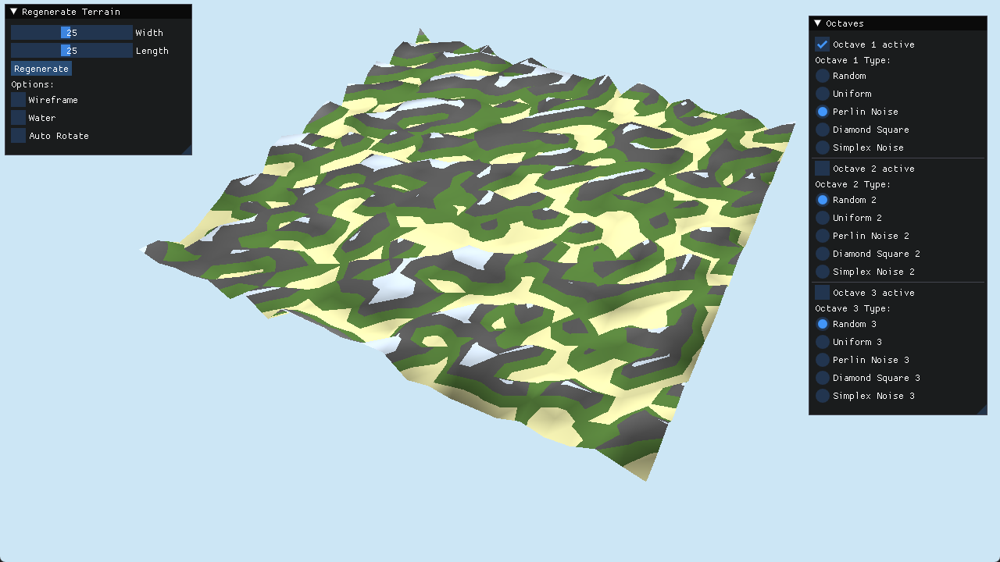

# GeoGraphix

C++/OpenGL terrain generator made using GLFW and Dear ImGui. Supports multiple modes of terrain generation:
1. uniform random
2. flat
3. diamond square algorithm
4. perlin noise algorithm
5. simplex noise algorithm

With additional support for octaves for combinations and permutations of the above algorithms.

Comes with UI and mouse controls such as terrain rotation and scroll to zoom.

